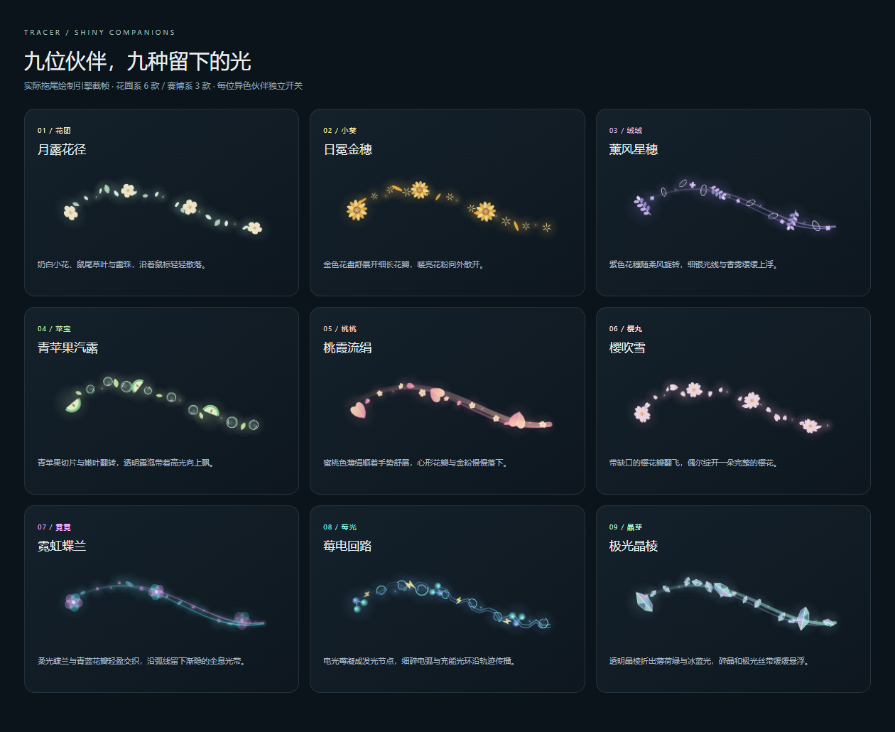

# 异色伙伴专属拖尾

在桌面版进入「桌宠小屋 → 伙伴图鉴」，选择已解锁的异色伙伴，再到「照料」查看专属拖尾的名称、实际绘制预览和开关。每位异色伙伴单独记住开关；切换到已开启的伙伴时，拖尾跟随切换。普通伙伴和自定义伙伴不显示这个开关。

桌面悬浮伙伴也支持相同操作：鼠标移到伙伴上，点击工具栏的「打开面板」，在「照料」中开关拖尾；主工作窗口隐藏时仍可操作。

| 伙伴 | 拖尾 | 形状与运动 |
| --- | --- | --- |
| 花团 | 月露花径 | 奶白五瓣花、鼠尾草叶与露珠，翻转并轻轻散落 |
| 小葵 | 日冕金穗 | 十二瓣金色花盘、细长花瓣与放射花粉，向外散开 |
| 绒绒 | 薰风星穗 | 紫色花穗、小花与银色细环，伴随双层香雾缓缓上浮 |
| 苹宝 | 青苹果汽露 | 带果核的青苹果切片、嫩叶和透明高光露泡，旋转上升 |
| 桃桃 | 桃霞流绢 | 桃色宽薄绢与细金边，心形花瓣和小花逐渐飘落 |
| 樱丸 | 樱吹雪 | 带缺口的樱花瓣与完整樱花，侧向飘散并翻转 |
| 霓霓 | 霓虹蝶兰 | 品红与青蓝圆润蝶兰、透明花瓣与露珠，沿连续曲线轻盈渐隐 |
| 莓光 | 莓电回路 | 三颗发光莓果节点、闪电和扩张的充能环，折线电弧 |
| 晶芽 | 极光晶棱 | 薄荷绿、冰蓝与淡紫分面晶棱，高光星芒与悬浮极光丝 |

[查看动态预览](shiny-companion-trails.webm) · [查看伙伴界面](shiny-trail-controls.png)

[霓虹蝶兰平滑调整前后对比](neon-orchid-trail-smooth.png) · [平滑效果动态对比](neon-orchid-trail-smooth.webm)

## 设置与运行

- 新用户默认关闭。原来的全局拖尾设置会作为九位伙伴的初始偏好；第一次切换开关时保存为独立设置。
- 设置保存在账户隔离的 `tracer.garden.trails.v2`，退出、重开应用后保留。
- 效果覆盖鼠标所在屏幕，不拦截点击、不抢焦点；移动到另一块显示器时清理旧轨迹。
- 停止移动后，粒子在约 0.7–1.6 秒内消散，动画调度随之停止。移动时鼠标采样与绘制目标为 60 帧/秒，高刷新率屏幕也不额外增加绘制帧数；最多 120 个粒子、32 个轨迹点。
- 鼠标静止 500 毫秒后降至 20 Hz 位置检查，跳过显示器查询和 IPC；再次移动在下次检查时发送新坐标并恢复 60 Hz（正常调度下最多等待 50 毫秒）。关闭、锁屏、休眠或减少动态效果时停止采样。
- 光晕预先缓存，光带路径与渐变只在轨迹点变化时重建。粒子直接设置合并变换，只清理实际变化区域并跳过离屏粒子，减少逐帧 Canvas 调用和临时对象。
- 桌面透明画布的像素倍率最高为 1.5，总像素不超过 3840 × 2160；高分屏以较低的软光采样成本保留连续曲线。以 1920 × 1080、DPR 2 为例，画布从 829 万像素降至 467 万（减少 43.75%）；这是画布像素数，不等同于整机 GPU 占用降幅。伙伴面板静态预览保留原有清晰度。
- 光带采用连续曲线，莓电回路保留电弧折线；光带摆动按路径距离固定，尾部消退时不会牵动整条轨迹。暂停后重新移动会开启新轨迹，旧粒子独立淡出。霓虹蝶兰使用圆润透明花瓣、柔光露珠与短暂淡入，减少棱角和突然出现的跳变。
- 伙伴面板中的预览是静态截帧，不持续运行动画。浏览器版可看预览，开关仅桌面版可用。
- 锁屏、休眠或系统「减少动态效果」会暂停拖尾。关闭开关或换到普通伙伴会销毁透明窗口并停止光标采样。

## 验证

`test/garden-trails.test.js` 检查九种伙伴映射和设置迁移；`desktop/test/garden-trail.test.js` 检查解锁条件、主题切换、显示器坐标、锁屏、清理与 IPC 来源。

`dev/qa-garden-trails.cjs` 使用生产 Canvas 引擎检查九种不同画面、粒子上限和动画结束清理，并生成截图与视频。`dev/qa-garden-trail.cjs` 使用独立用户目录启动真实 Electron，通过伙伴图鉴和开关逐款验证，并检查重载后的设置记忆。测试收获记录和 IPC 坐标仅在隔离进程内注入，不更改日常账户。

`dev/qa-garden-trail-smooth.cjs` 对比生产引擎修改前后的回环、稀疏急转弯与不均匀采样轨迹，检查曲线稳定性、60 Hz 绘制、暂停后的独立轨迹，以及结束后的像素与动画调度清理。2026-09-25：7 项拖尾单元测试、九款 Canvas 效果检查和平滑回归检查通过；30 个 60 Hz 动画帧中，新版绘制 30 次，旧版绘制 15 次。

同日的低开销优化通过 25 项桌面测试、2 项拖尾目录/设置测试、九款 Canvas 检查和平滑回归。`dev/qa-garden-trail-performance.cjs` 使用同一轨迹、原生 Canvas、2 轮预热与 7 轮交错测量，对比本轮优化前的 60 帧版本。以下为本机 Headless Edge 的每帧 CPU 提交耗时（7 轮均值的中位数），包含 JavaScript 与绘制命令提交，不代表 GPU 或系统合成耗时：

| 1920 × 1080 逻辑画布 | 优化前 | 桌面优化后 |
| --- | --- | --- |
| DPR 1 | 0.306 ms | 0.229 ms |
| DPR 1.5 | 0.335 ms | 0.249 ms |
| DPR 2 | 0.346 ms | 0.253 ms |

60、120、144 Hz 的确定性调度检查均在 2 秒内绘制 120 帧；消散后的透明像素、待运行 RAF 和静止重复点触发的绘制均为零。粒子、轨迹点、预缓存精灵和高分屏像素预算检查通过。[测量明细](garden-trail-performance.json) · [高分屏画质对比](neon-orchid-trail-resolution.png)。

2026-09-23：0.4.0 发布复验中，654 项核心测试、23 项桌面测试全部通过。九款画布效果与 Windows Electron 实测通过，包含悬浮伙伴窄面板、主窗口隐藏时切换开关和页面重载记忆；Mac arm64 与 Mac x64 云端原生运行环境也通过相同的打包应用检查。[查看验收记录](https://github.com/AndyLiu010802/Tracer/actions/runs/35834504837)。
